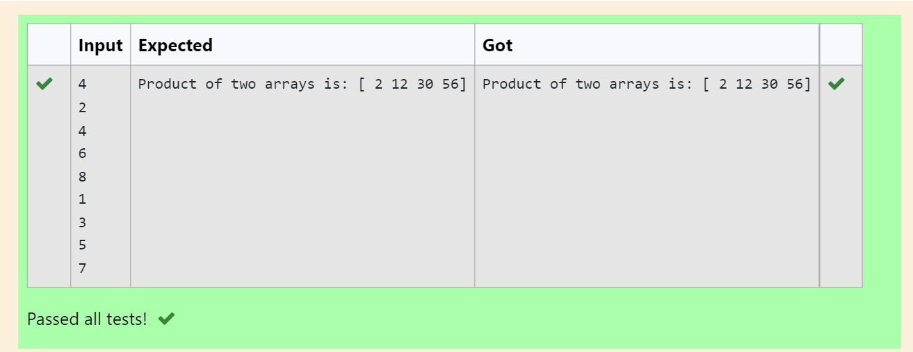

# Multiplying-two-matrix

## AIM:

## ALGORITHM:

### Step 1:
### Step 2:
### Step 3:
### Step 4:
### Step 5:

## PROGRAM: 
```
import numpy as np
num1,num2=[],[]
n=int(input())
for i in range(n):
    num1.append(int(input()))
for i in range(n):
    num2.append(int(input()))
value1=np.array(num1)
value2=np.array(num2)
result=value1*value2
print("Product of two arrays is:",result)
```

## OUTPUT:


## RESULT:
thus multiplied the two matrix
